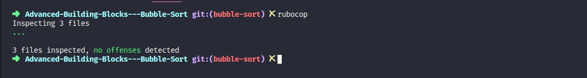

<!-- PROJECT SHIELDS -->
[![Forks][forks-shield]][forks-url]
[![Stargazers][stars-shield]][stars-url]
[![Issues-open][issues-open-shield]][issues-url]
[![Issues-closed][issues-closed-shield]][issues-url]
[![Contributors][contributors-shield]][contributors-url]
[![Framework][badge-framework]][framework-url]
[![contributions welcome][contributions-welcome]][issues-url]

<!-- PROJECT LOGO -->
 

  

  <h1 align="center">
	Advanced Building Blocks -Bubble-Sort
  </h1>

  

    Our implementation of the Bubble Sort Algorithm with Ruby
     
	  🖊️
    Read the article
    🐞
    <a href="https://github.com/Israel-Laguan/Advanced-Building-Blocks---Bubble-Sort/issues">Report a Bug</a>
    🙋‍♂️
    <a href="https://github.com/Israel-Laguan/Advanced-Building-Blocks---Bubble-Sort/issues">Request Feature</a>
  

# The Project

Bubble Sort is the simplest sorting algorithm that works by repeatedly swapping the adjacent elements if they are in wrong order.

In this project, we implemented the bubble sort algorithm. The focus is on the use of yield and passing a block to a method. We created a method that sorts an array. This algorithm has a O(n2) at the worst case scenario. We included another method that accepts a block to sort an array of strings by length.

You need to have Ruby installed in your computer to run this file. Also you can run it on [Repl.it](https://repl.it/), click below.

## Run Code Online

## Table of Contents

1. [Validations](#validations)
2. [Features](#features)
3. [Built With](#built-with)
4. [Authors](#authors)
5. [Contributing](#contributing)
6. [Show your support](#show-your-support)
7. [License](#license)

# Validations

Rubocop: 

# Features

* Method #bubble_sort that takes an array and returns a sorted array. It must use the bubble sort methodology
* A similar method called #bubble_sort_by which sorts an array by accepting a block.
* Both Methods accepting a block using yield()
* Basic tests on methods
* %W operator for array of strings

# Built With

* `ruby` v2.5.5+
* RVM
* `vscode` with _Ruby_ and _Rubocop_ extensions
* Linux
* Love and Passion for code.

# Authors

<table style="width:100%">
  <tr>
    <td>
        

            
            <h2>
                <a href="https://israel-laguan.github.io/" target="_blank" rel="author">
                    Israel Laguan
                </a>
            </h2>
        

    </td>
    <td>
        

            <a href="mailto:israellaguan@gmail.com" target="_blank" rel="author">
                
                <h3>
                    Email me to 
                    <a href="mailto:israellaguan@gmail.com">
                        israellaguan@gmail.com
                    </a>
                </h3>
            </a>
            <a href="https://www.linkedin.com/in/israellaguan/" target="_blank" rel="author">
                
                <h3>
                    Connect to my Linkedin
                </h3>
            </a>
            <a href="https://github.com/Israel-Laguan" target="_blank" rel="author">
                
                <h3>
                    Check my GitHub Profile
                </h3>
            </a>
        

    </td>
  </tr>
  <tr>
	  <td>
			

            
            <h2>
                <a href="https://github.com/izaiasneto4" target="_blank" rel="author">
                    Izaias Neto
                </a>
            </h2>
        

    </td>
    <td>
        

            <a href="mailto:izaiasneto4@gmail.com" target="_blank" rel="author">
                
                <h3>
                    Email me to 
                    <a href="mailto:izaiasneto4@gmail.com">
                        izaiasneto4@gmail.com
                    </a>
                </h3>
            </a>
			

		</td>
  </tr>
</table> 

# Contributing

[![contributions welcome][contributions-welcome]][issues-url]

🤝 Contributions, issues and feature requests are welcome!
Feel free to check the [issues page][issues-url].

# Show your support

🤗 Give a ⭐️ if you like this project!

Icons from:

<a href="https://icons8.com">Icons8</a>

# License

[![License][badge-license]](http://badges.mit-license.org)

📝 This project is licensed under the [MIT](LICENSE)\
Feel free to fork this project and improve it - see the [LICENSE.md](LICENSE.md) file for details 

<!-- MARKDOWN LINKS & IMAGES -->
[contributors-shield]: https://img.shields.io/github/contributors/Israel-Laguan/Advanced-Building-Blocks---Bubble-Sort?style=for-the-badge
[contributors-url]: https://github.com/Israel-Laguan/Advanced-Building-Blocks---Bubble-Sort/graphs/contributors
[forks-shield]: https://img.shields.io/github/forks/Israel-Laguan/Advanced-Building-Blocks---Bubble-Sort?style=for-the-badge
[forks-url]: https://github.com/Israel-Laguan/Advanced-Building-Blocks---Bubble-Sort/network/members
[stars-shield]: https://img.shields.io/github/stars/Israel-Laguan/Advanced-Building-Blocks---Bubble-Sort?style=for-the-badge
[stars-url]: https://github.com/Israel-Laguan/Advanced-Building-Blocks---Bubble-Sort/stargazers
[issues-open-shield]: https://img.shields.io/github/issues/Israel-Laguan/Advanced-Building-Blocks---Bubble-Sort?style=for-the-badge
[issues-url]: https://github.com/Israel-Laguan/Advanced-Building-Blocks---Bubble-Sort/issues
[issues-closed-shield]: https://img.shields.io/github/issues-closed/Israel-Laguan/Advanced-Building-Blocks---Bubble-Sort?style=for-the-badge
[badge-framework]: https://img.shields.io/badge/language-Ruby-red?style=for-the-badge&logo=ruby
[framework-url]: https://www.ruby-lang.org/
[contributions-welcome]: https://img.shields.io/badge/contributions-welcome-brightgreen.svg?style=for-the-badge
[badge-license]: https://img.shields.io/:license-mit-blue.svg?style=for-the-badge
